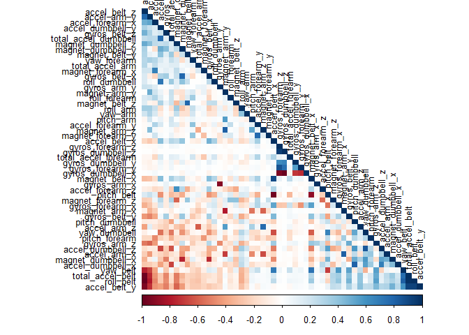
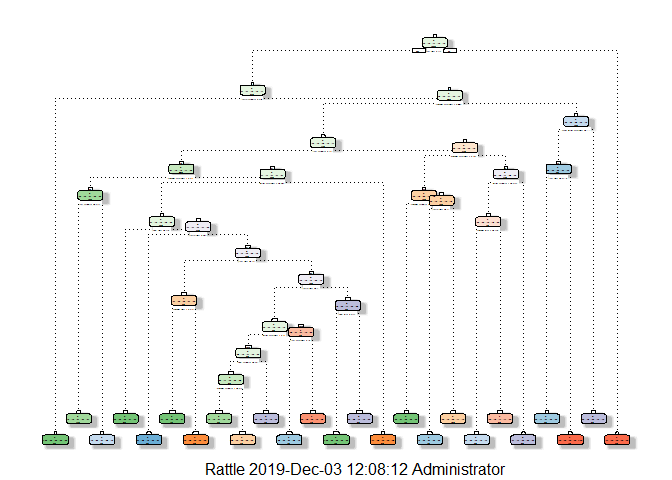

Practical Machine Learning Course Project
================
B Fallis
03/12/2019

## Overview

Using devices such as Jawbone Up, Nike FuelBand, and Fitbit it is now
possible to collect a large amount of data about personal activity
relatively inexpensively. These type of devices are part of the
quantified self movement – a group of enthusiasts who take measurements
about themselves regularly to improve their health, to find patterns in
their behavior, or because they are tech geeks. One thing that people
regularly do is quantify how much of a particular activity they do, but
they rarely quantify how well they do it. In this project, the goal will
be to use data from accelerometers on the belt, forearm, arm, and
dumbell of 6 participants to create a machine learning model that can
predict the manner of activity performed.

## Datasets

The training data for this project are available here:

<https://d396qusza40orc.cloudfront.net/predmachlearn/pml-training.csv>

The test data are available here:

<https://d396qusza40orc.cloudfront.net/predmachlearn/pml-testing.csv>

The data for this project come from
<http://groupware.les.inf.puc-rio.br/har> which details the activities
carried out as:

“Six young health participants were asked to perform one set of 10
repetitions of the Unilateral Dumbbell Biceps Curl in five different
fashions: exactly according to the specification (Class A), throwing the
elbows to the front (Class B), lifting the dumbbell only halfway (Class
C), lowering the dumbbell only halfway (Class D) and throwing the hips
to the front (Class E).

Class A corresponds to the specified execution of the exercise, while
the other 4 classes correspond to common mistakes. Participants were
supervised by an experienced weight lifter to make sure the execution
complied to the manner they were supposed to simulate. The exercises
were performed by six male participants aged between 20-28 years, with
little weight lifting experience. We made sure that all participants
could easily simulate the mistakes in a safe and controlled manner by
using a relatively light dumbbell (1.25kg)."

## Data Loading and Cleaning

Load
    libraries

``` r
library(caret)
```

    ## Loading required package: lattice

    ## Loading required package: ggplot2

``` r
library(tidyverse)
```

    ## -- Attaching packages --------------------------------------- tidyverse 1.2.1 --

    ## v tibble  2.1.1     v purrr   0.3.2
    ## v tidyr   0.8.3     v dplyr   0.8.1
    ## v readr   1.3.1     v stringr 1.4.0
    ## v tibble  2.1.1     v forcats 0.4.0

    ## -- Conflicts ------------------------------------------ tidyverse_conflicts() --
    ## x dplyr::filter() masks stats::filter()
    ## x dplyr::lag()    masks stats::lag()
    ## x purrr::lift()   masks caret::lift()

``` r
library(corrplot)
```

    ## corrplot 0.84 loaded

``` r
library(rpart)
library(rpart.plot)
library(rattle)
```

    ## Rattle: A free graphical interface for data science with R.
    ## Version 5.2.0 Copyright (c) 2006-2018 Togaware Pty Ltd.
    ## Type 'rattle()' to shake, rattle, and roll your data.

``` r
library(randomForest)
```

    ## randomForest 4.6-14

    ## Type rfNews() to see new features/changes/bug fixes.

    ## 
    ## Attaching package: 'randomForest'

    ## The following object is masked from 'package:rattle':
    ## 
    ##     importance

    ## The following object is masked from 'package:dplyr':
    ## 
    ##     combine

    ## The following object is masked from 'package:ggplot2':
    ## 
    ##     margin

Download data and read into R

``` r
# Set URL and local file paths
URLTrain <- "https://d396qusza40orc.cloudfront.net/predmachlearn/pml-training.csv"
URLTest  <- "https://d396qusza40orc.cloudfront.net/predmachlearn/pml-testing.csv"

DestTrain <- "pml-training.csv"
DestTest <- "pml-testing.csv"

#If files don't exist, download them, then read them in.
if(!file.exists(DestTrain)){
        download.file(URLTrain, DestTrain)
}
if(!file.exists(DestTest)){
        download.file(URLTest, DestTest)
}

train <- read_csv(DestTrain)
```

    ## Warning: Missing column names filled in: 'X1' [1]

    ## Parsed with column specification:
    ## cols(
    ##   .default = col_double(),
    ##   user_name = col_character(),
    ##   cvtd_timestamp = col_character(),
    ##   new_window = col_character(),
    ##   kurtosis_roll_belt = col_character(),
    ##   kurtosis_picth_belt = col_character(),
    ##   kurtosis_yaw_belt = col_character(),
    ##   skewness_roll_belt = col_character(),
    ##   skewness_roll_belt.1 = col_character(),
    ##   skewness_yaw_belt = col_character(),
    ##   max_yaw_belt = col_character(),
    ##   min_yaw_belt = col_character(),
    ##   amplitude_yaw_belt = col_character(),
    ##   kurtosis_picth_arm = col_character(),
    ##   kurtosis_yaw_arm = col_character(),
    ##   skewness_pitch_arm = col_character(),
    ##   skewness_yaw_arm = col_character(),
    ##   kurtosis_yaw_dumbbell = col_character(),
    ##   skewness_yaw_dumbbell = col_character(),
    ##   kurtosis_roll_forearm = col_character(),
    ##   kurtosis_picth_forearm = col_character()
    ##   # ... with 8 more columns
    ## )

    ## See spec(...) for full column specifications.

    ## Warning: 182 parsing failures.
    ##  row               col expected  actual               file
    ## 2231 kurtosis_roll_arm a double #DIV/0! 'pml-training.csv'
    ## 2231 skewness_roll_arm a double #DIV/0! 'pml-training.csv'
    ## 2255 kurtosis_roll_arm a double #DIV/0! 'pml-training.csv'
    ## 2255 skewness_roll_arm a double #DIV/0! 'pml-training.csv'
    ## 2282 kurtosis_roll_arm a double #DIV/0! 'pml-training.csv'
    ## .... ................. ........ ....... ..................
    ## See problems(...) for more details.

``` r
test <- read_csv(DestTest)
```

    ## Warning: Missing column names filled in: 'X1' [1]

    ## Parsed with column specification:
    ## cols(
    ##   .default = col_logical(),
    ##   X1 = col_double(),
    ##   user_name = col_character(),
    ##   raw_timestamp_part_1 = col_double(),
    ##   raw_timestamp_part_2 = col_double(),
    ##   cvtd_timestamp = col_character(),
    ##   new_window = col_character(),
    ##   num_window = col_double(),
    ##   roll_belt = col_double(),
    ##   pitch_belt = col_double(),
    ##   yaw_belt = col_double(),
    ##   total_accel_belt = col_double(),
    ##   gyros_belt_x = col_double(),
    ##   gyros_belt_y = col_double(),
    ##   gyros_belt_z = col_double(),
    ##   accel_belt_x = col_double(),
    ##   accel_belt_y = col_double(),
    ##   accel_belt_z = col_double(),
    ##   magnet_belt_x = col_double(),
    ##   magnet_belt_y = col_double(),
    ##   magnet_belt_z = col_double()
    ##   # ... with 40 more columns
    ## )
    ## See spec(...) for full column specifications.

The first 7 columns appear to be related to the individual conducting
the activity and so will be removed from both the training and test
datasets as they provide no relevant data for the model.

``` r
train <- train %>%
        select(-c("X1", "user_name", "raw_timestamp_part_1", "raw_timestamp_part_2", "cvtd_timestamp", "new_window", "num_window"))

test <- test %>%
        select(-c("X1", "user_name", "raw_timestamp_part_1", "raw_timestamp_part_2", "cvtd_timestamp", "new_window", "num_window"))
```

Remove columns where there is only 1 value or where the variance between
values is very small.

``` r
nearzerovariance <- nearZeroVar(train)

train <- train[, -nearzerovariance]
test  <- test[, -nearzerovariance]

dim(train)
```

    ## [1] 19622   113

``` r
dim(test)
```

    ## [1]  20 113

Remove columns where more than 95% of the value are NA. These columns
will not play a role in the model since there are so many missing
values.

``` r
naColumns <- sapply(train, function(x) mean(is.na(x))) > 0.95
train <- train[, naColumns == FALSE]
test  <- test[, naColumns == FALSE]
```

Split the training data into an 80/20% split so we can build the model
and test it.

``` r
set.seed(1234)

data_split  <- createDataPartition(y = train$classe, p = 0.8, list = FALSE)
model_train <- train[data_split, ]
model_test  <- train[-data_split, ]
```

Use Correlation matrix to find the most highly correlated variables.

``` r
correlation_matrix <- cor(model_train[, -53])

corrplot(correlation_matrix, order = "FPC", method = "color", type = "lower", tl.cex = 0.8, tl.col = rgb(0, 0, 0))
```

<!-- -->

``` r
high_correlation = findCorrelation(correlation_matrix, cutoff = 0.8)

names(model_train)[high_correlation]
```

    ##  [1] "accel_belt_z"     "roll_belt"        "accel_belt_y"    
    ##  [4] "accel_dumbbell_z" "accel_belt_x"     "pitch_belt"      
    ##  [7] "accel_dumbbell_x" "accel_arm_x"      "magnet_arm_y"    
    ## [10] "gyros_forearm_y"  "gyros_dumbbell_x" "gyros_dumbbell_z"
    ## [13] "gyros_arm_x"

## Model Creation and Testing

We will analyse 2 different machine learning models to determine which
is the better option, decision tree and random forest.

#### Decision Tree

Create a decision tree model (with plot visualisation)

``` r
set.seed(1234)

decision_tree_model <- rpart(classe ~ ., data = model_train, method="class")
fancyRpartPlot(decision_tree_model)
```

    ## Warning: labs do not fit even at cex 0.15, there may be some overplotting

<!-- -->

Test the model on the test data and use a confusion matrix to work out
the accuracy of the
model.

``` r
decision_tree_predict <- predict(decision_tree_model, model_test, type = "class")

confusionMatrix(decision_tree_predict, as.factor(model_test$classe))
```

    ## Confusion Matrix and Statistics
    ## 
    ##           Reference
    ## Prediction    A    B    C    D    E
    ##          A 1011  126    9   34   11
    ##          B   41  486   72   54   70
    ##          C   33   61  537   94   96
    ##          D   11   53   49  402   31
    ##          E   20   33   17   59  513
    ## 
    ## Overall Statistics
    ##                                           
    ##                Accuracy : 0.7517          
    ##                  95% CI : (0.7379, 0.7652)
    ##     No Information Rate : 0.2845          
    ##     P-Value [Acc > NIR] : < 2.2e-16       
    ##                                           
    ##                   Kappa : 0.6852          
    ##                                           
    ##  Mcnemar's Test P-Value : < 2.2e-16       
    ## 
    ## Statistics by Class:
    ## 
    ##                      Class: A Class: B Class: C Class: D Class: E
    ## Sensitivity            0.9059   0.6403   0.7851   0.6252   0.7115
    ## Specificity            0.9359   0.9251   0.9123   0.9561   0.9597
    ## Pos Pred Value         0.8489   0.6722   0.6541   0.7363   0.7991
    ## Neg Pred Value         0.9616   0.9147   0.9526   0.9286   0.9366
    ## Prevalence             0.2845   0.1935   0.1744   0.1639   0.1838
    ## Detection Rate         0.2577   0.1239   0.1369   0.1025   0.1308
    ## Detection Prevalence   0.3036   0.1843   0.2093   0.1392   0.1637
    ## Balanced Accuracy      0.9209   0.7827   0.8487   0.7906   0.8356

#### Random Forest

Create a random forest model

``` r
set.seed(1234)

forest_model_control <- trainControl(method = "cv", number = 3, verboseIter = FALSE)

random_forest_model <- train(classe ~ ., data = model_train, method="rf", trControl = forest_model_control)
```

Test the model on the test data and use a confusion matrix to work out
the accuracy of the model.

``` r
random_forest_predict <- predict(random_forest_model, model_test)

confusionMatrix(random_forest_predict, as.factor(model_test$classe))
```

    ## Confusion Matrix and Statistics
    ## 
    ##           Reference
    ## Prediction    A    B    C    D    E
    ##          A 1116    5    0    0    0
    ##          B    0  753    4    0    0
    ##          C    0    1  679    4    0
    ##          D    0    0    1  639    1
    ##          E    0    0    0    0  720
    ## 
    ## Overall Statistics
    ##                                           
    ##                Accuracy : 0.9959          
    ##                  95% CI : (0.9934, 0.9977)
    ##     No Information Rate : 0.2845          
    ##     P-Value [Acc > NIR] : < 2.2e-16       
    ##                                           
    ##                   Kappa : 0.9948          
    ##                                           
    ##  Mcnemar's Test P-Value : NA              
    ## 
    ## Statistics by Class:
    ## 
    ##                      Class: A Class: B Class: C Class: D Class: E
    ## Sensitivity            1.0000   0.9921   0.9927   0.9938   0.9986
    ## Specificity            0.9982   0.9987   0.9985   0.9994   1.0000
    ## Pos Pred Value         0.9955   0.9947   0.9927   0.9969   1.0000
    ## Neg Pred Value         1.0000   0.9981   0.9985   0.9988   0.9997
    ## Prevalence             0.2845   0.1935   0.1744   0.1639   0.1838
    ## Detection Rate         0.2845   0.1919   0.1731   0.1629   0.1835
    ## Detection Prevalence   0.2858   0.1930   0.1744   0.1634   0.1835
    ## Balanced Accuracy      0.9991   0.9954   0.9956   0.9966   0.9993

The random forest model is 99.59% accurate in predictions compared to
75.17% for the decision tree and as such will be used for the quiz that
follows submission.
